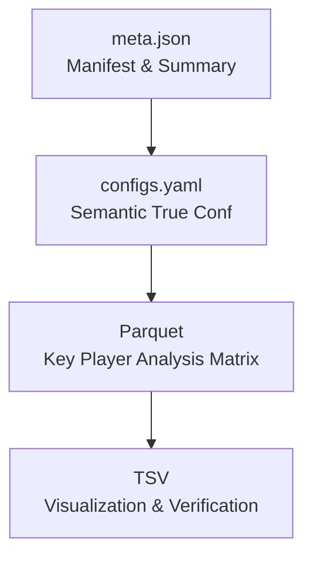

# 📘 Data Architecture & File Format Specification

---

## v0.0

### 1. Overview（总览）

本项目的数据与配置体系由四类文件构成：

| 层级                                  | 文件类型                  | 职责（一句话）                                          |
| ------------------------------------- | ------------------------- | ------------------------------------------------------- |
| 数据主源（Data Source of Truth）      | Parquet / Parquet Dataset | 高速 I/O、固定 schema、作为下游分析的核心数据结构       |
| 可读展示层（Human-Readable Layer）    | TSV（制表符文本）         | 人工查看、快速校验、绘图输入，小文件场景最佳            |
| 语义真源（Semantic Source of Truth）  | configs.yaml              | 决定 pipeline 行为的唯一配置真源                        |
| 入口映射与摘要（Manifest & Snapshot） | meta.json                 | 用于跨语言模块加载 out 目录的索引与摘要，不参与分析逻辑 |

这四者形成了一个清晰的职责分层体系：



---

### 2. Parquet / Parquet Dataset

#### 2.1 需求来源

- 需要在分析阶段进行高频读写（如 Normalize / Filter / Diff / Enrichment）；
- 行数/列数较大（蛋白矩阵几十 MB 到几百 MB）；
- 希望减少文本解析开销；
- 希望支持 schema 稳定性（字段类型、字段名）；
- 希望可被多语言（Python, R, Rust, Go）一致读写。

#### 2.2 设计初衷

- 作为分析的核心数据载体；
- 作为可复跑、可持久化的稳定格式；
- 保证数据类型一致、无损、快速、半结构化。

#### 2.3 选择理由（为什么选 Parquet 而不是 CSV/TSV/HDF5）

- 列式存储，高效筛选（filter）、聚合（group-by）；
- 类型明确，避免字符串推断；
- 压缩效果好（ZSTD / Snappy）；
- 支持 Dataset（多文件分区），适合大规模数据；
- 跨语言支持最好（pyarrow、polars、arrow-rs、Spark）。

#### 2.4 典型使用场景

- 信息表：`info-samples.parquet` / `info-contrasts.parquet`
- 定量矩阵：protein / peptide intensity matrix
- annotation 映射表
- large intermediate tables（normalized, imputed, filtered）

#### 2.5 注意事项

- 字段类型必须固定；
- 禁止存储“表示语义的配置”（如 cutoff），那些属于 YAML；
- 禁止混入可变结构（list/struct），除非 schema 稳定；
- 推荐压缩：`zstd(level=3~5)`。

#### 2.6 Anti-pattern（绝不能这么用）

❌ 把 parquet 当配置文件
 ❌ 在 parquet 中隐含分析参数（如 normalization method）
 ❌ 手动编辑 parquet（不可行）

---

### 3. TSV（制表符文本文件）

#### 3.1 需求来源

- 可读性强，适合人工快速校验；
- 绘图脚本（R/ggplot2、Python/Seaborn）直接 ingest；
- 文件尺寸通常小（几百 KB～几 MB）；
- 研发/质检人员需要手动检查。

#### 3.2 设计初衷

- 作为“人机界面层（Human Interface Layer）”；
- 绘图不是 I/O 密集型，不需要 parquet 的复杂性；
- 用作快速 debug、结果展示。

#### 3.3 选择理由（为什么不选 CSV/Excel）

- CSV 易受逗号干扰，不如 TSV 稳；
- Excel 不可追踪 diff，不利于版本控制，文件体积大；
- TSV 行为可预测，跨语言兼容好。

#### 3.4 使用场景

- 各类 plotting 数据（各类 input.tsv）
- info-samples.tsv / info-contrasts.tsv（人类可读版本）
- 上下游研发交流文件

#### 3.5 注意事项

- 字段类型丢失，请使用 parquet 作为严肃分析输入；
- 只保证可读，不保证类型语义；
- 建议对列名和编码进行统一规范（SnakeCase / PascalCase）。

#### 3.6 Anti-pattern

❌ 用 TSV 替代 Parquet 作为分析主力文件
 ❌ 把高维数据（>10 MB）放 TSV 导致 I/O 延迟

---

### 4. configs.yaml

#### 4.1 角色定义：Semantic Source of Truth（语义真源）

> configs.yaml 是唯一决定 pipeline 行为的配置来源。
> 任何涉及“分析逻辑”的内容必须以 YAML 为准。

#### 4.2 需求来源

- 平台差异（MQ / DIA-NN）决定读取矩阵方式；
- TMT 需要 reference channel、normalization 策略；
- 物种 / reference 信息影响注释流程；
- 项目元数据（客户编号、项目名称）影响报告；
- 将来会加入分析参数（cutoff、impute、normalization）。

#### 4.3 设计初衷

- 存储“影响分析语义的所有参数”；
- 人类可读可编辑；
- 便于审计、复跑、版本控制；
- 作为整个项目的“世界观定义”。

#### 4.4 选择理由（为什么 YAML 而非 JSON/TOML）

- YAML 更适合非技术用户阅读；
- 注释支持好；
- 结构清晰，团队可快速阅读；
- JSON 不支持注释，不利于审计；
- 相比于 `toml` ，`yaml` 的适用范围、平台支持更广泛。

#### 4.5 使用场景

- 任何会影响分析流程的模块均必须读取：
  - Normalize / Filter
  - Diff / Enrichment
  - Heatmap
  - QC / Summary
  - WDL / Nextflow orchestration

#### 4.6 注意事项

- configs.yaml 不能缺失；
- 不能被 meta.json 替代；
- 不能包含过大嵌套结构（保持最低复杂性）；
- 所有参数必须稳定可追踪。

#### 4.7 Anti-pattern

❌ 把分析逻辑硬编码到 Python / R 中，而不是写在 YAML
 ❌ 在 meta.json 中重复并扩展 YAML 内容
 ❌ 使用 JSON 作为配置真源（团队不易读）

---

### 5. meta.json

#### 5.1 角色定义：入口索引 & 摘要快照（Manifest & Snapshot）

> meta.json 并非配置源，不参与决定分析逻辑。
> 它存在的唯一目的：让任何语言/模块能只凭 /out 目录启动整个项目。

#### 5.2 核心职责

- 统一入口（entrypoint）；
- 快速预览（n_samples, n_contrasts, platform）；
- 文件索引（manifest）：
  - info-samples.parquet
  - info-contrasts.parquet
  - configs.yaml

#### 5.3 需求来源

- 跨语言（Python/R）统一加载接口；
- 需要“self-describing directory”；
- Dashboard / Web 前端需要摘要信息；
- CLI 工具需要快速检查输出情况。

#### 5.4 设计初衷

- 不存放业务语义；
- 不扩展配置内容；
- 可从 YAML + parquet 完全重建。

#### 5.5 为什么选择 JSON

- 前端、后端通用；
- 无需额外依赖；
- 易被各种语言解析；
- schema 压力可控。

#### 5.6 注意事项

- 不能与 configs.yaml 形成冲突；
- 不能包含会改变分析结果的字段；
- 仅用于入口导航与摘要。

#### 5.7 Anti-pattern

❌ 在 meta.json 中存储 cutoff、normalization 等分析参数
 ❌ 把 meta.json 当主配置文件
 ❌ 在不同模块里手写 meta.json 导致不一致

---

### 6. 四者的关系总结（重点）

| 文件类型     | 是否参与分析逻辑     | 是否人工可读   | 是否人手可编辑 | 是否跨模块入口     | 是否主数据源 |
| ------------ | -------------------- | -------------- | -------------- | ------------------ | ------------ |
| configs.yaml | ✔✔✔（主要依据）   | ✔             | ✔             | ✔                 | ✘           |
| meta.json    | ✘（不能参与）       | ✔             | ✘             | ✔✔✔（唯一入口） | ✘           |
| parquet      | ✔✔✔（主要数据源） | 部分（需工具） | ✘             | ✔                 | ✔           |
| tsv          | ✘（仅展示）         | ✔✔✔         | ✔✔✔         | 可选               | ✘           |

总结一句话：

> 配置看 YAML，数据看 Parquet，绘图看 TSV，入口看 JSON。
> 四者没有替代关系，只是职责不同。

---

### 7. Pipeline 加载流程（建议实现）

```python
def load_project(dir_out: Path):
    meta = load_meta(dir_out)                # 查 index、查文件名
    cfg = load_yaml(dir_out/meta['Files']['ConfigsYaml'])   # 真源
    df_samples   = load_parquet(dir_out/meta['Files']['InfoSamplesParquet'])
    df_contrasts = load_parquet(dir_out/meta['Files']['InfoContrastsParquet'])
    return cfg, df_samples, df_contrasts
```

所有核心算法：

- 不读 meta.json
- 只读 cfg（yaml）和 df_xxx（data）

干净、稳定、易测试。

---

### 8. Usage Examples（使用示例）

本节演示：

1. intake 模块如何输出 `configs.yaml` 与 `meta.json`
2. 输出文件推荐内容示例
3. 下游模块如何读取它们并进入分析流程

---

#### 8.1 上游 intake 输出示例

假设 intake 输入：

```bash
in/
  ├── sample_info.json
  ├── compare_group_info.json
  ├── project_info.json
  ├── config_mqpar.xml   （或 config_diann.json）
  └── options.xlsx
```

intake 输出文件夹：

```bash
out/
  ├── info-samples.parquet
  ├── info-samples.tsv
  ├── info-contrasts.parquet
  ├── info-contrasts.tsv
  ├── configs.yaml
  └── meta.json
```

---

#### 8.2 示例：configs.yaml（语义真源）

```yaml
platform:
  Engine: DIA-NN
  Version: "2.2.0"
  FilenamesFasta:
    - Bovine_UP000009136_2025_08_04.fasta
  FilenamesLibrary: []
  FilenameProteins: report.pg_matrix.tsv
  FilenamePeptides: report.pr_matrix.tsv

project:
  ProjectCode: SNWD042825100601
  ProjectName: "Astral DIA 标准蛋白组"
  CustomerName: "孙德鹏"
  CustomerUnit: "山东师范大学"

ref:
  Name: Bos taurus (Bovine)
  Version: v1
  DownloadUrl: https://www.uniprot.org/proteomes/UP000009136
```

> 注意：configs.yaml 的特点：
>
> - 只包含“分析语义”相关的内容；
> - 所有值可被 pipeline 再次读取决定行为；
> - 不存储 runtime 信息，不存储摘要，不存储文件路径。

---

#### 8.3 示例：meta.json（入口索引 + 摘要）

```json
{
  "SchemaVersion": "1.0.0",
  "IntakeVersion": "0.2.1",
  "RunAt": "2025-12-11T11:35:02+08:00",

  "DirIn": "/project/proteomics/tests/test_a/in",
  "DirOut": "/project/proteomics/tests/test_a/out",

  "Platform": {
    "Engine": "DIA-NN",
    "Version": "2.2.0"
  },

  "Project": {
    "ProjectCode": "SNWD042825100601",
    "ProjectName": "Astral DIA 标准蛋白组"
  },

  "Files": {
    "ConfigsYaml": "configs.yaml",
    "InfoSamplesParquet": "info-samples.parquet",
    "InfoContrastsParquet": "info-contrasts.parquet",
    "InfoSamplesTsv": "info-samples.tsv",
    "InfoContrastsTsv": "info-contrasts.tsv"
  },

  "Samples": {
    "NSamples": 10,
    "NGroups": 2
  },

  "Contrasts": {
    "NTotal": 3,
    "NTTest": 1,
    "NAnova": 2
  }
}
```

> meta.json 特点：
>
> - 不包含语义信息（比如 FASTA 路径、TMT 配置等）；
> - 只用于“找到文件、知道数量、知道平台展示信息”；
> - 永远可从 `configs.yaml + parquet` 重建。

---

#### 8.4 下游：读取 meta.json 与 configs.yaml 的标准方式

下面展示推荐的分层加载方式：

---

##### （1）顶层入口：load_project()

```python
import json
import yaml
import polars as pl
from pathlib import Path


def load_project(dir_out: Path):
    """Load a completed proteomics project using meta.json + configs.yaml."""

    # 1. load meta.json（可选，但强烈建议）
    file_meta = dir_out / "meta.json"
    if file_meta.exists():
        meta = json.loads(file_meta.read_text())
        files = meta["Files"]
    else:
        # fallback — 不建议长期使用，但兼容历史
        files = {
            "ConfigsYaml": "configs.yaml",
            "InfoSamplesParquet": "info-samples.parquet",
            "InfoContrastsParquet": "info-contrasts.parquet",
        }
        meta = None

    ## 2. load configs.yaml（必须）
    cfg = yaml.safe_load((dir_out / files["ConfigsYaml"]).read_text())

    ## 3. load Parquet data（分析主力）
    df_samples   = pl.read_parquet(dir_out / files["InfoSamplesParquet"])
    df_contrasts = pl.read_parquet(dir_out / files["InfoContrastsParquet"])

    return cfg, df_samples, df_contrasts, meta
```

---

##### （2）下游分析模块示例

##### 差异分析 diff

```python
def run_diff(cfg, df_samples, df_contrasts, df_matrix):
    engine = cfg["platform"]["Engine"]

    if engine == "DIA-NN":
        # 使用 DIA-NN 规则读取矩阵
        pass
    else:
        # MaxQuant 规则
        pass

    # 依照 df_samples 和 df_contrasts 遍历分析
    ...
```

特点：

- diff 函数不再需要 meta.json；
- 它只依赖 “语义配置”（yaml）+ “数据”（parquet）
  → 稳定、可测、无副作用。

---

###### （3）绘图模块示例（使用 TSV 输入）

我们推荐绘图使用 TSV，因为：

- 人工可读可编辑；
- R/ggplot2 兼容性更好；
- 体量小（绘图不需要大矩阵）。

```r
df <- read.delim("out/info-samples.tsv")
ggplot(df, aes(Group, SampleAlias)) + 
    geom_point()
```

---

#### 8.5 总结：下游到底该读什么？

| 功能                                          | 读取 YAML？ | 读取 meta.json？ | 读取 Parquet？ | 读取 TSV？ |
| --------------------------------------------- | ----------- | ---------------- | -------------- | ---------- |
| Pipeline 入口                                 | ✔          | ✔               | ✔             | 可选       |
| 分析主逻辑（diff, normalization, enrichment） | ✔（必须）  | ✘               | ✔（必须）     | ✘         |
| 绘图                                          | ✘          | 可选             | 可选           | ✔（推荐） |
| 前端或报告展示                                | 可选        | ✔（必须）       | ✘             | 可选       |
| 调试 / 人工审阅                               | 可选        | ✔               | ✋（不推荐）   | ✔         |

一句话总结：

> meta.json 用来“找到东西”；
> configs.yaml 用来“决定怎么分析”；
> parquet 是“数据”；
> tsv 是“视觉与人工的接口”。

### Q&A

#### meta.json 是 YAML + 数据文件的子集吗？

对，而且必须是子集。

meta.json 的设计原则只有一个：

> 把 “out 目录最小、最有用、最可复算的摘要信息” 放在一个跨语言最友好的 JSON 文件里。
> 它不能包含任何无法从 configs.yaml 或 info-\*.parquet 推导的“新的业务语义”。

所以 meta.json：

- 不能：新增分析参数、阈值、TMT 方案、引擎策略
- 不能：保存 YAML 里没有的配置来源
- 不能：有任何“业务决策”

它只能是：

✔ 目录索引
✔ 摘要（样本数、对比数）
✔ 平台/项目的少量展示级信息（可从 YAML 再算回来）

严格来说：

> meta.json = configs.yaml 的强摘要
> ＋ info-samples/contrasts 的计数级摘要
> ＋ out 文件结构的 manifest（索引）

它必须是一个不损坏“单一真源”原则的缓存/快照，不是新的真源。

#### “单一真源” (configs.yaml) 与 “不能当真源” (meta.json) 的区别是什么？

> configs.yaml 是“真实世界语义的来源”。
> meta.json 是“流程运行快照 + 目录索引”。

换更贴近你项目的话：

##### configs.yaml（真源）包含“解释分析逻辑所需的信息”

它属于 domain truth（业务真源）：

- 这个项目是谁的（客户/项目编号）
- 平台是什么、版本是多少
- 样本相关的上下游配置
- 物种/ reference 信息
- 未来会包含分析参数，例如：
  - p-value cutoff
  - imputation method
  - normalization method
  - allowed missingness 规则

这些内容会影响最终分析输出。
 因此 YAML 是真源（source of truth）。

##### meta.json（不能当真源）只适合保存不会改变分析语义的信息

- run 时间
- intake 版本
- 文件名索引（告诉你哪份 parquet 是样本、哪份是 contrasts）
- 样本数量、对比数量
- 平台/项目的“展示级别摘要”

这些信息 删掉 meta.json 仍然可以完整复算。
 它没有业务语义，不参与分析决策，只参与流程使用体验。

所以 meta.json：

- 不是参数表
- 不是分析定义
- 不是依赖文件
- 不是业务真源
- 只是入口索引（manifest）＋ 快照（snapshot）

#### 这个需求是否真实？还是伪需求？

> 会有另一个模块/另一门语言/前端，只拿到 out 目录，希望有统一入口。

那么 meta.json：

##### ✔ 不是伪需求；是真实需求，但属于“接口需求”，非业务需求

它解决一个现实问题：

> “Given only a path to /out, how do I know里面有哪些文件、平台是什么、多少样本、多少对比？”

如果没有 meta.json：

- R 模块必须猜信息、硬编码 file 名
- 前端必须猜 info-samples.tsv 名称
- Python 模块之间必须共享复杂 schema
- 不同流程的入口方式不统一
- out 目录不具备自描述性（self-describing）

如果有 meta.json：

- 所有模块启动方式统一：
    load_project("/out") → read meta.json → read必要文件
- 前端不需要解析 YAML（JSON 更友好）
- 跨语言可以无损沟通
- 以后更新文件命名规则，不需要更新所有消费者

所以 meta.json 的需求来自：真实的跨模块、跨语言、跨前端协作场景，而不是业务逻辑本身。

#### configs.yaml（YAML）最终在整个系统里承担什么职责？

configs.yaml = 全流程中“人类可读、可编辑、可解释”的业务配置真源。

它的角色是：

##### （1）业务语义真源（Domain Source of Truth）

包括：

- 平台信息 → 会影响读取逻辑（MQ vs DIA-NN）
- Fasta / Library → 会影响定量解释
- TMT reference → 会影响归一化
- ref（物种）→ 会影响注释逻辑
- 项目信息 → 会影响转交和审计
- 未来参数（阈值、impute 策略、QC 规则）

所有分析行为必须从 YAML 推导。

##### （2）是用户可检查、可追踪的配置文件（Human-facing file）

- JSON 不适合给用户直接阅读
- YAML 可以作为“分析配置报告”一部分
- 项目交付检查也要看 YAML 是否正确
- pipeline 版本迁移时 YAML 是最稳定 anchor

##### （3）是未来多项目、多版本兼容的锚点

以后你版本升级：

- meta.json 可以变
- parquet 可以变
- 文件布局可以变
- 但 configs.yaml 必须稳定、可兼容

因为它是业务配置的唯一真源。

##### 最终统一视图

三层结构：

```text
1) 真源（Source of Truth） → configs.yaml
   - 所有业务含义
   - 所有分析参数
   - 所有 platform/ref/project 实体信息
   - 任何可以影响分析语义的东西

2) 数据文件（Truth of Data） → info-samples / info-contrasts / expression
   - 表结构
   - 实际样本矩阵
   - 所有可计算数据

3) 索引与摘要（Manifest + Summary） → meta.json
   - 入口索引
   - 文件名
   - 样本/对比计数
   - run 元信息
   - 非语义性摘要（展示级）
```

三者关系：

- meta.json 从 YAML + parquet 派生
- yaml 永不依赖 meta.json
- parquet 永不依赖 meta.json
- meta.json 从来不能影响分析结果

所以 meta.json 的本质地位是：

> 非业务性的入口索引，不是配置，不是语义，不是参数。
